## Klotter — scientific multiline calculator

Klotter is a scientific calculator that graphs what you type. Every cell carries a live plot, so
editing an expression redraws the curve as you write it. It is built for clarity, precision, and
fast iterative exploration.

<p align="center">
  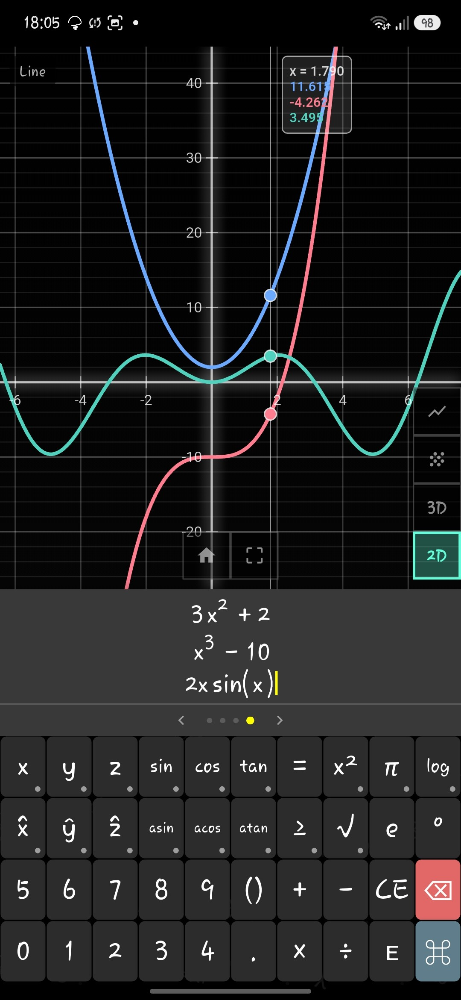
  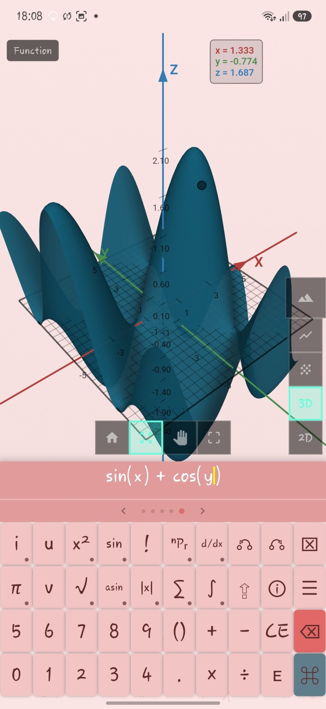
  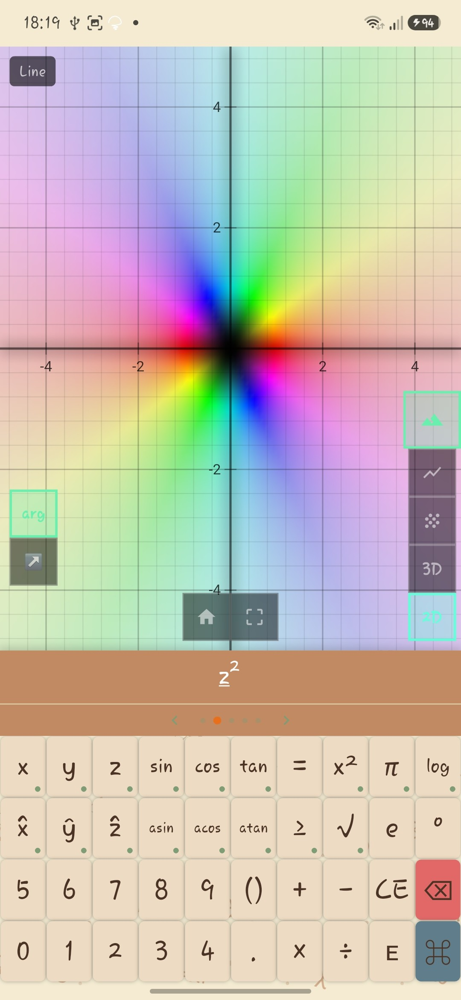
</p>

---

## Key features

### Multiple expressions per plot

Each plot holds a stack of rows, and every row is its own curve on shared axes.

- Press ⌘ to add a row to the plot you are looking at.
- A coloured dot marks each row, and the curve takes that colour in 2D and in 3D.
- The eye beside a row hides its curve without deleting it or moving the others.
- A row that cannot be drawn is marked, so you can tell which line is at fault.

<p align="center">
  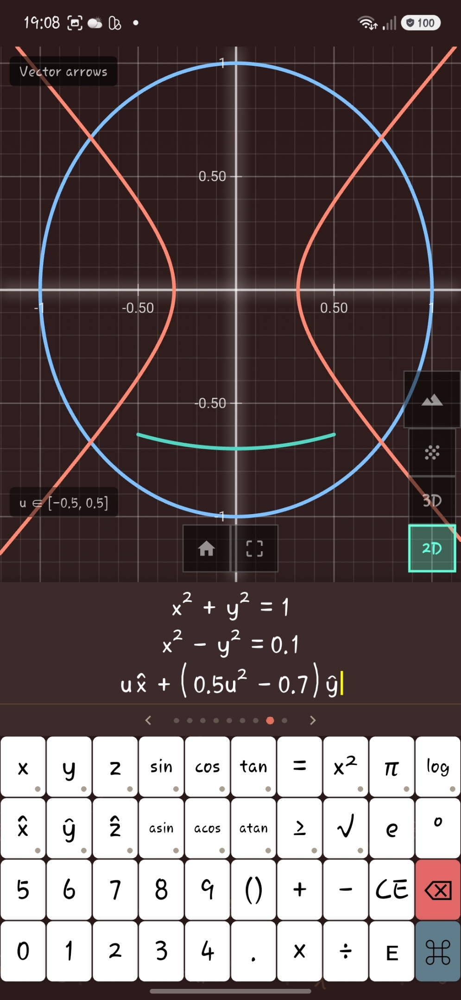
</p>

---

### Structural mathematics input

Klotter shows mathematics as it is written rather than as plain text.

- Press `/` to create a fraction.
- Press `xⁿ` to insert an exponent.
- Tap any part of an expression to put the cursor there.
- Long-press a variable to work in polar or spherical coordinates. The plot converts for you.

---

### What you can plot

A cell is a stack of lines, and they need not be the same kind of plot. A sweep, two level sets,
and a height surface share one set of axes.

| Type | How to write it |
|---|---|
| Curve | `x` alone, as in `sin(x)` |
| Surface | `x` and `y` together, as in `x^2+y^2` |
| Implicit curve or surface | An equation, as in `x^2+y^2=1` |
| Vector field | Unit vectors, as in `y x̂ - x ŷ` |
| Parametric sweep | `u` and `v` with unit vectors, as in `u x̂ + u^2 ŷ` |
| Complex function | `z̲`, reached by holding the `i` key |

<p align="center">
  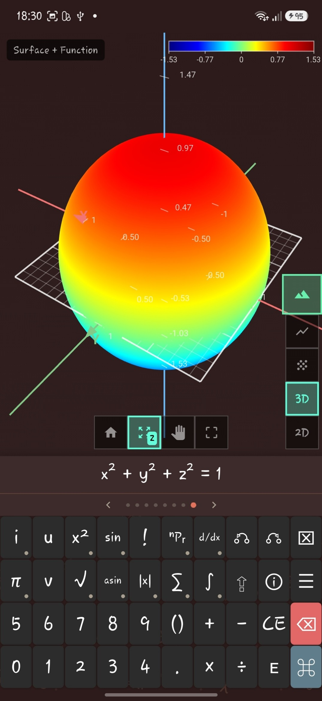
  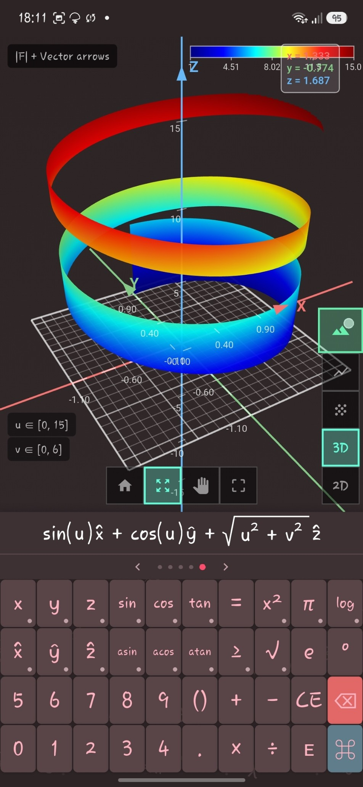
  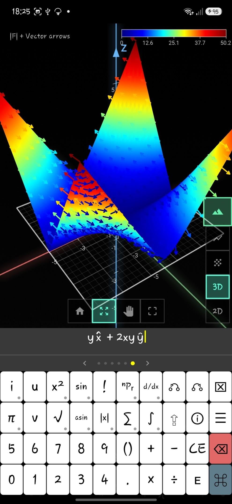
</p>

---

### Reading a plot

- Long-press a curve or a surface for a readout of the value at that point.
- Turn on contour lines to read a surface by level.
- In 3D, turn on the mesh to see a surface's own grid.
- A colour scale accompanies each field, so the colours state a measurement rather than an identity.

<p align="center">
  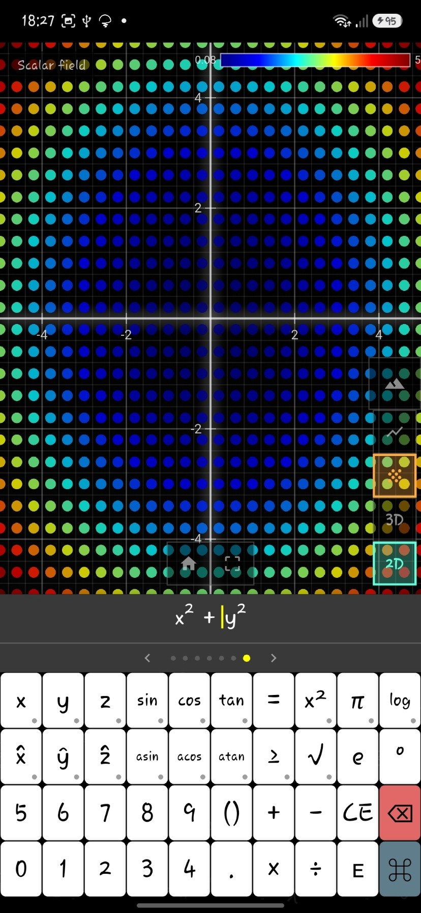
  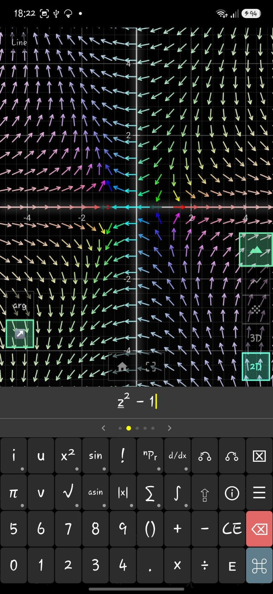
  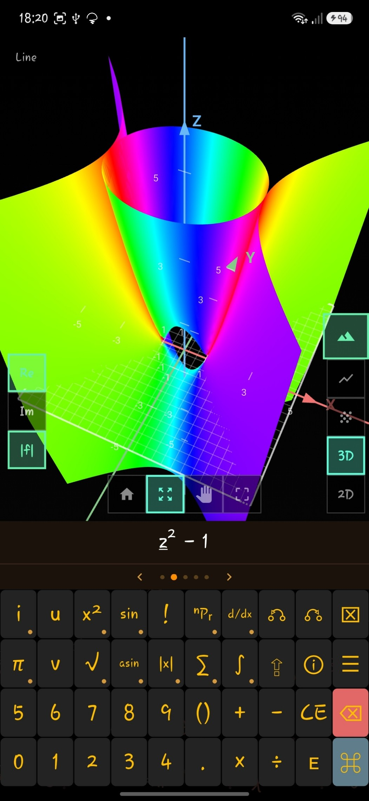
</p>

---

### Plot navigation

- Swipe the strip above the keypad to move between plots, or to start a new one.
- In 2D, drag to pan and pinch to zoom.
- In 3D, drag to rotate, or switch to pan. The zoom control can be constrained to one axis.
- In 2D, home returns to a fixed frame: x from -5 to 5 and y from -10 to 10, whatever is
  plotted. In 3D, home frames the box around what is on the axes.
- Switching between 2D and 3D cross-fades and keeps your view.

<p align="center">
  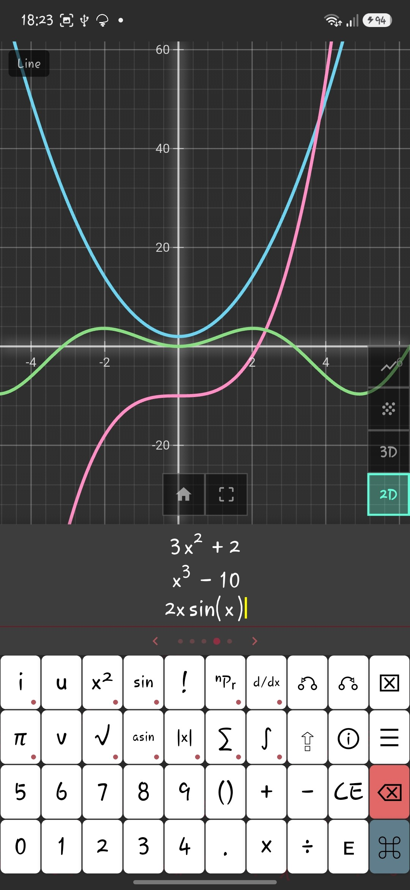
</p>

---

### Undo and redo

- ⎌ undoes the last edit, one keystroke at a time.
- The mirrored ⎌ redoes it.
- Both keys dim when there is nothing left to undo or redo.

---

### Customisation

- Decimal precision.
- Themes, including a light theme and several dark ones.
- Left-handed layout, which mirrors the keypad and the plot controls.
- Haptic feedback.

Open these from the settings (☰) key on the extras keypad.

---

## Build

Klotter is a Flutter application.

```
flutter pub get
flutter run
```

To produce a release build for Android, run `flutter build appbundle --release`. Before you
publish, work through [the release checklist](RELEASE_CHECKLIST.md).
